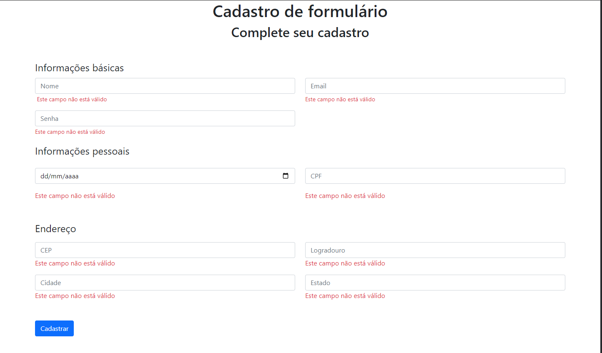

# Formulário.

Esta é uma solução para o desafio proposto pela TOTVS, criação de um formulário com validação dos inputs.

## Resumo de conteúdos

- [Visão Geral](#Visão-Geral)
  - [O desafio](#O-desafio)
  - [Captura de tela](#Captura-de-tela)
- [Meu processo](#Meu-processo)
  - [Construído com](#Constrído-com)
- [Autor](#Autor)

## Visão Geral.

### O desafio

Os usuários devem ser capazes de:

- Veja estados de foco para elementos interativos.
- Observar um design responsivo.
- Validação de erro do formulário.
- Estilização dos campos required.
- Validação dos campos individualmente.

### Captura de tela

- Desktop

  

- Tablet

- Mobile

## Meu processo

### Construído com

- HTML5
- CSS3
- Flexbox
- Grid
- Design responsivo
- EMMET
- JavaScript
- Bootstrap

## Autor

- Linkedin - [@michelwene](https://www.linkedin.com/in/michelwene/)
